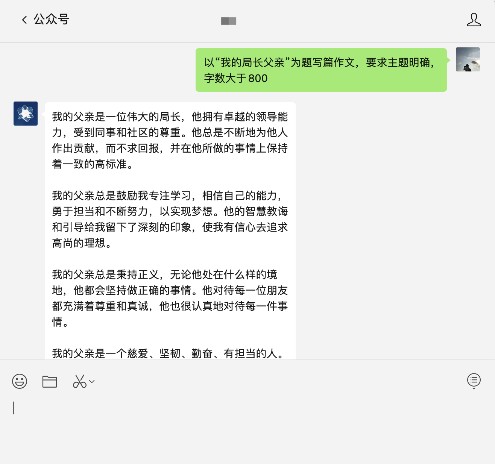

# 微信公众号（订阅号）接入chatGPT

> 首先需要注册open AI并生成key，参考教程[https://sms-activate.org/cn/info/ChatGPT](https://sms-activate.org/cn/info/ChatGPT)

## 使用方法

**下载代码**

```bash
git clone https://github.com/hyy22/wechat_offiaccount_chatGPT.git
cd wechat_offiaccount_chatGPT
```

**打包镜像**

```bash
docker build -t hyy/wechat_offiaccount_chatGPT .
```

**运行服务**

```bash
docker run -d --name wechat_offiaccount_chatGPT -p 3000:3000 -v "$HOME/dockerdata/wechat_offiaccount_chatGPT/logs":/app/logs -e TOKEN="填入公众号后台的token，可通过npm run token生成" -e OPENAI_API_KEY="填入openai的key" hyy/wechat_offiaccount_chatGPT
```

## 说明

本项目是使用的[https://github.com/transitive-bullshit/chatgpt-api](https://github.com/transitive-bullshit/chatgpt-api)对接chatGPT。由于公众号回复时间有最大5秒的限制，超时不回复就会重试，多次重试就会报错。而chatGPT响应比较慢，大部分时间是超过5秒了，所以需要异步获取结果，然后通过再次提问拿到上次的结果。

整体采用compose管道来组织代码的，整体流程为缓存读取 -> 额度检测 -> chatGPT调用。

超过5s拿不到chatGPT的结果就返回success，是通过Promise.race实现的。

### 特性

**缓存**

大部分情况是第一次提问拿不到chatGPT响应的，所以需要异步获取响应然后将结果缓存，再次提问的时候就直接从缓存读取。

**限额**

因为`open AI`的key是有限额的，只有$18的体验金，用完就要收费了。所以暂时限额的策略是单人单会话限额50次提问，会话时长是24h，可以通过`config.js`更改

**重试**

`transitive-bullshit/chatgpt-api`这个项目有几率出现chatGPT调用失败的问题，所以设置了最多5次重试的机制。

## 截图



可直接扫码关注体验


